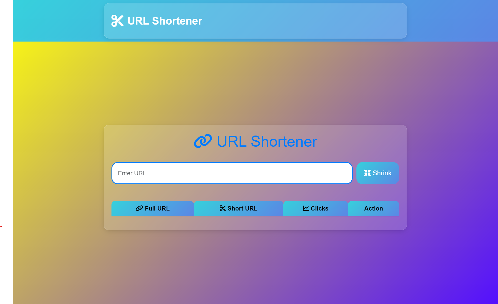

# URL Shortener



A simple and elegant URL shortener web application built using Node.js, Express, and MongoDB. The application allows users to shorten long URLs and keep track of the number of clicks on each shortened URL.

## Features

- Shorten long URLs
- Track the number of clicks on each shortened URL
- Delete shortened URLs
- Responsive and visually appealing UI with a glassmorphism design

## Technologies Used

- Node.js
- Express.js
- MongoDB
- EJS (Embedded JavaScript templates)
- Bootstrap
- Font Awesome

## Installation

1. Clone the repository:
    ```sh
    git clone https://github.com/sinhaaman3256/url-shortener.git
    ```
2. Navigate to the project directory:
    ```sh
    cd url-shortener
    ```
3. Install the dependencies:
    ```sh
    npm install
    ```

## Usage

1. Start the server:
    ```sh
    node server.js
    ```
2. Open your browser and go to `http://localhost:5000`

## Project Structure

